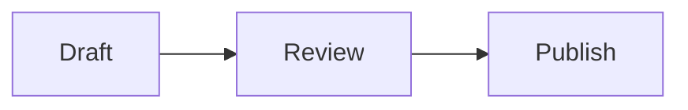

Tunelito is local-first. It does not upload your source HTML or Markdown to a hosted backend.

## Runtime pieces

The CLI starts a local server for one HTML or Markdown file, or a folder of HTML and Markdown files. The server reads HTML from disk or renders Markdown into a readable page, injects the Tunelito browser client into served page responses, and serves non-hidden assets from the selected file directory or folder root. In Markdown, fenced `mermaid` blocks render as diagrams while other fenced languages remain code.

The browser client handles:

- text selection
- comment composition
- comment sidebar
- assigned reviewer names and explicit renaming
- unanchored page notes and site-wide notes
- optional presenter pointer halos on fine-pointer devices
- live sync over WebSocket, plus WebRTC data channels in `--live`
- highlight rendering when the browser supports it
- reload notices when the file changes

The server handles:

- review-key access control
- WebSocket upgrades
- WebRTC signaling and fallback relay events in `--live`
- comment validation
- Markdown persistence, unless `--live` is enabled
- file watching
- packaged same-origin Mermaid assets for Markdown pages that contain diagrams
- page-specific and site-wide comment streams when serving a folder
- optional Cloudflare Tunnel startup

When `--agent` is enabled, a separate worker handles:

- watching the persistent comments file, with interval polling as a fallback
- invoking Codex, Claude Code, or a custom local command
- continuing comments that return `needs_followup` with completed and remaining tasks
- recording status in `.tunelito/agent/state.json`
- writing a readable `.tunelito/agent/log.md`

When `--agent-session` is enabled, Tunelito does not invoke another CLI. The server process writes `.tunelito/session.json`, watches the comments inbox, claims actionable comments for the current coding-agent session, prints bounded prompts, shows reviewer-facing status on comment cards, exposes the same tracker through `tunelito inbox status`, and records results through `tunelito inbox record`.

## Source files are not modified

The injection happens only in the HTTP response. Your source HTML and Markdown files remain untouched by Tunelito's annotation layer.

## Mermaid diagrams

Use a normal Mermaid fence in a Markdown document:

````markdown

````

Tunelito loads Mermaid from its installed package, not a CDN, so rendering remains local/offline and the asset uses the same review-key protection as the page. It initializes Mermaid once per page with strict security, HTML labels and click actions disabled, and bounded text/edge limits. Valid diagrams become responsive SVG. The escaped source remains available under **View Mermaid source**; invalid syntax, an oversized diagram, or a runtime failure opens that source and shows a readable error instead of leaving a blank page. Add Mermaid `accTitle` and `accDescr` statements when the diagram needs an explicit accessible name and description.

## Persistence

Comments are written to Markdown beside the page by default:

```text
page.html
page.comments.md
```

Markdown targets use the same sidecar shape:

```text
notes.md
notes.comments.md
```

For folder targets, the default inbox is beside the folder:

```text
site/
site.comments.md
```

The Markdown remains readable if Tunelito is never opened again. Hidden metadata inside the file lets Tunelito restore live comments after a restart and tie new comments to a stable reviewer identity for renames. Folder comments include visible scopes and page paths so a person or coding agent can map page feedback back to the right HTML or Markdown file and treat site feedback as applying across the folder.

`tunelito comments inspect` reads that same hidden metadata and prints a derived `tunelito-comments` JSON index for agents and diagnostics. The command does not write to the comments file or source files. When an agent ledger path is known, the index also includes the same pending, claimed, resolved, and follow-up status used by `inbox status` and browser comment-card badges.

The local agent worker and active-agent inbox commands do not edit this Markdown file. They treat comments as an append-only inbox and write resolution state beside the served root under `.tunelito/agent/`. That hidden ledger is not served as static content and does not trigger document reload notices. It also stores continuation state for comments that need multiple bounded passes, so the next agent prompt can continue from saved remaining tasks instead of redoing completed work.

## Live mode

`--live` stores comments in memory only. The browser client shares comments, cursors, and selection highlights over WebRTC data channels when possible. The WebSocket connection remains the authenticated control channel for room membership, WebRTC signaling, reload notices, and fallback relay when peer-to-peer connectivity is unavailable.
