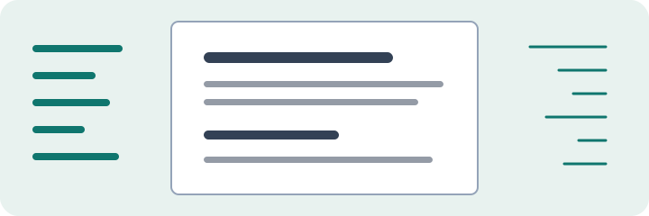
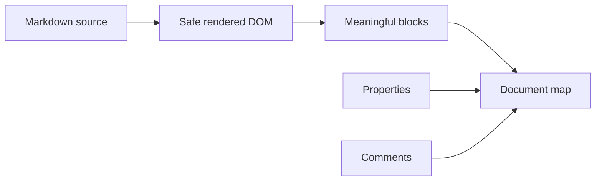

# Kitchen-sink Markdown review

This fixture combines every supported top-level ruler block with the transform boundaries that must remain intact.

## Prose and links

Ordinary [safe links](https://example.com) keep their URL behavior. Wiki references such as [[Tunelito]], [[Review workflow|the workflow]], [[Tunelito#Security]], and [[#Local section]] use the unresolved reference treatment.

Inline code remains literal: `[[Inline code]]`, `---`, and `<script>alert('no')</script>`. The unsupported embed stays visible: ![[diagram.png]].

### Lists

- One top-level list creates one ruler mark.
- Nested items do not create extra marks.
  - Nested diagnostic item
  - Another nested item

1. Ordered lists also count once.
2. Their descendants stay within the same block.

> A blockquote is one authored destination, even when its prose wraps across several lines in the review page.

### Table

| Surface | Side | Expected behavior |
| --- | --- | --- |
| Properties | Left | Collapsible metadata |
| Article | Center | Stable readable width |
| Document map | Right | Real content ticks |
| Comments | Right | No overlap with map |

### Fenced code boundaries

```yaml
---
status: code-not-front-matter
wiki: "[[Do not transform fenced code]]"
---
```

```html
<script>[[Still code, never a wiki link]]</script>
```

### Local image



### Mermaid figure



---

## Local section

The final paragraph follows a thematic break and gives the ruler one last ordinary destination.
